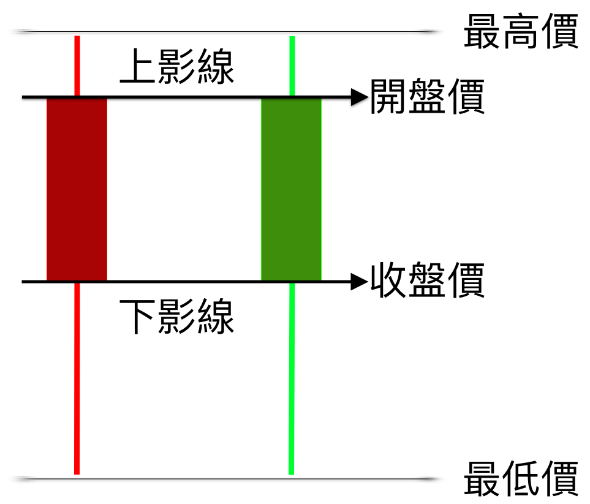

# 基本介紹

### Ｋ線圖

投資人為了在股市中獲得最大化利益，除了基本盤分析以及新聞來判斷公司股價的走向; 還有一種方法是技術分析。  
在技術分析裡面主要有一種方式就是透過查看Ｋ線圖的型態或樣貌來判斷股價的走向。

在Ｋ線圖上我們可以看到主要由紅色與綠色的長柱體\(K線\)所形成的，接下來我們先簡單介紹一個這個K線代表的意義。

### Ｋ線介紹

看到此圖，首先不管是紅色的還是綠色的，他的組成要件都是公司股票每日的最高價、開盤價、收盤價和最低價所組成，而其位子如上圖所示。  
上影線就是指開盤價到最高價的距離線  
下影線則是指收盤價到最低價的距離線

所以當每日的K線組成的歷史圖形我們就稱之為Ｋ線圖。  
  

