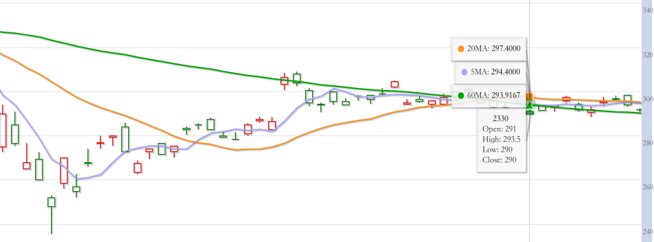

# 均線

移動平均均線，簡稱均線\(Moving Average簡稱MA\)。 代表過去一段時間的平均成交價格。  
換句話說就是，過去一段時間市場的「平均成交價格」，如果均線的價格越來越高，代表現階段的股票趨勢是向上的; 也就代表著代表投資人看好這檔股票。

###  均線圖

我們可以看到此圖有三條線，分別為紫色\(5MA\)、橘色\(20MA\)、綠色\(60MA\)。  
也就是說，紫色線條是以五天為單位的平均成交價格算產生的線條。而橘色、綠色也是如此。

| 均線 | 縮寫 | 代表意思 |
| :--- | :--- | :--- |
| 週線 | 5MA | 以每週平均成交價格來觀看此圖 |
| 月線 | 20MA | 以每月平均成交價格來觀看此圖 |
| 季線 | 60MA | 以每季平均成交價格來觀看此圖 |

### 季線（生命線）

因此在長期\(季線，60MA\)來觀看股市的話，通常可以代表公司的長期趨勢。這是法人相當重視的一條線。例如當天Ｋ線跌下季線的話，就會有多空的情形發生。因此季線才會被俗稱為生命線。

