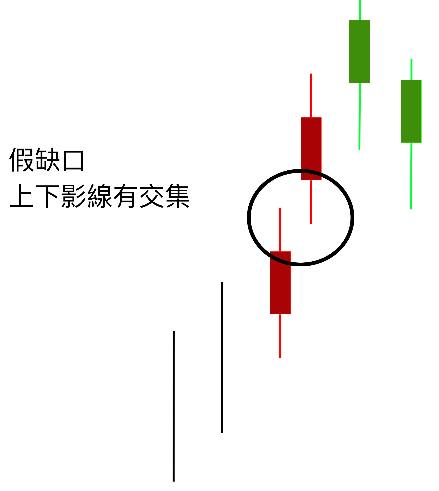

# 缺口

在股市Ｋ線的呈現上，缺口是最重要的角色，就像是一個像是驚嘆號一般的信號資訊，通常缺口的誕生，常常代表著股市的上漲與下跌。

### 缺口向上

### 缺口向下

### 缺口的誕生與意義

缺口的誕生，就像一個驚嘆號一般的出現，因為這中間完全沒有交易紀錄的誕生。也就是說如果向上的缺口，表示中間價位根本買不到; 出現向下的缺口，表示中間價位根本賣不掉。

為什麼會買不到跟賣不掉呢？ 這中間必然有一段故事，這個故事很有可能會大幅度影響股市的上漲或下跌。

### 缺口-手賤特區

在新手時期的時候，在缺口的判斷常常會不小心出錯，這邊提供大家一種最常見的誤判情形。

> 缺口現象發生的時候，新手時期的時候，在缺口的判斷常常會發生一個錯誤。如果當上下影線還是有交集的話，這不算是缺口哦～

