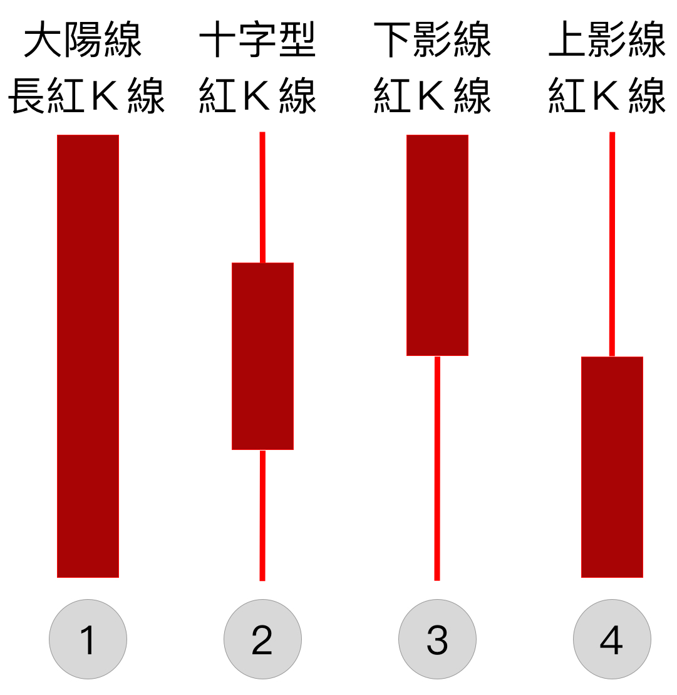
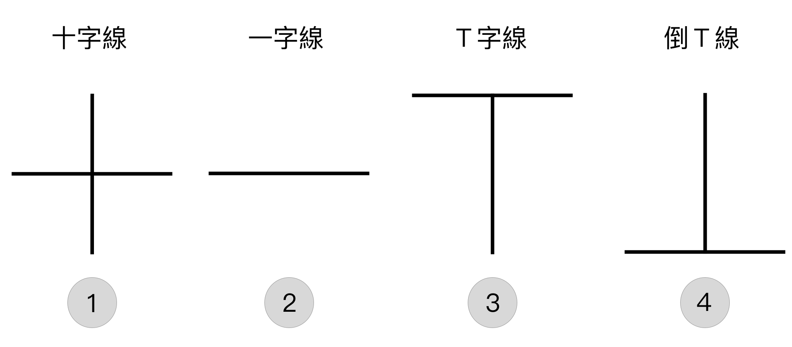

# Ｋ線的樣貌

上一單元我們介紹的Ｋ線的元件組成為最高價、開盤價、收盤價和最低價。  
這一單元我們將介紹一下，這些Ｋ線的樣貌以及其樣貌背後可能代表的意思。  
Ｋ線通常代表著當天投資人對於這隻股票的感受，所以有可能造成紅Ｋ、黑Ｋ的樣貌出現。

### Ｋ線樣貌

常見的有以上四種樣貌，分別為大陽線、十字型、下影線、上影線的紅Ｋ線

#### 第一種-大陽線

| 出現時機 | 可能代表意義 |
| :--- | :--- |
| 跌勢、整盤後 | 反轉、突破攻擊、買進信號 |
| 漲勢 | 領漲、延續漲勢 |
| 漲勢末端、漲高後 | 止漲信號 |

#### 第二種-十字型

| 出現時機 | 可能代表意義 |
| :--- | :--- |
| 跌勢 | 跌勢暫停或結束 |
| 漲勢 | 休息、觀望 |

#### 第三種-下影線

| 出現時機 | 可能代表意義 |
| :--- | :--- |
| 跌勢 | 醞釀止跌或反彈信號 |
| 漲勢 | 漲勢尚未結束、強力買盤的支撐 |

#### 第四種-上影線

| 出現時機 | 可能代表意義 |
| :--- | :--- |
| 跌勢 | 醞釀止跌或反彈信號 |
| 漲勢 | 高檔賣壓沈重、洗盤 |

### Ｋ線樣貌2

#### 第一種-十字線

| 出現時機 | 可能代表意義 |
| :--- | :--- |
| 買賣雙方力量相同 | 通常是一種反轉現象，需配合前後幾天走勢來觀察 |

#### 第二種-一字線

| 出現時機 | 可能代表意義 |
| :--- | :--- |
| 買賣方有一方特強 | 代表當天都是一個價位，表示投資人特別看好/壞這隻股票 |

#### 第三種-Ｔ字線

| 出現時機 | 可能代表意義 |
| :--- | :--- |
| 賣方量多、買方強勢 | 表示股價在盤中的時候一度下跌，但是買盤很強勁 |

#### 第四種-倒Ｔ線

| 出現時機 | 可能代表意義 |
| :--- | :--- |
| 買方量多，賣方強勢 | 表示股價在盤中的時候一度上漲，但是賣盤很強勁 |

有了上面的Ｋ線的樣貌，我們就能清楚的了解Ｋ線的意義了。

> 以上都先以紅Ｋ作為介紹，如果為綠Ｋ基本上就反過來看即可。

