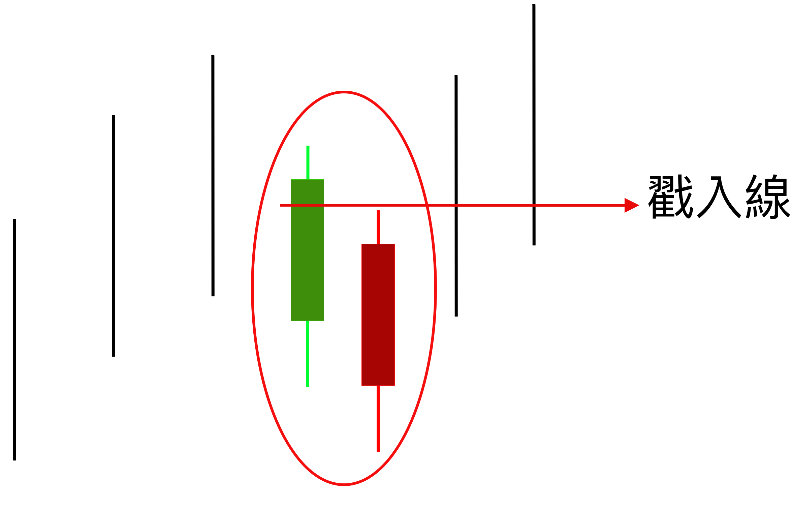
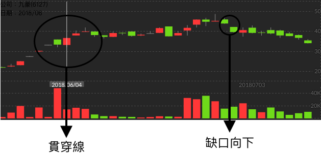

# 貫穿線

有時候在缺口向上跳空之後，會遇到拉黑在轉紅的貫穿線圖形  
首先我們先來看看貫穿線的圖形為何

在多方投入下，突然一個拉黑在轉紅，並且在紅Ｋ線是有確確實實的戳入綠Ｋ線的，這種圖形我們稱之為貫穿線。

### 貫穿線實際例子

我們在九豪，2018年5月29日發現了一個一個缺口以及後幾天的貫穿線圖形，基本上這樣的圖形就會形成多頭吞噬。

當然在後續可想而知還有一波上漲的空間，但是注意了，在2018年6月底左右，有一個跳空向下，這是一個很大的警訊，表示多頭吞噬的已經差不多了，賣壓開始加強，準備要下跌了。

> 雖然多頭吞噬這一類的，多半會讓自己的獲利有20％、30％甚至更多，但是記住要設立停利點，否則就跟賭徒沒兩樣了。（一但有停止上漲的訊號，記得一定要立刻停利，避免被套牢; 不要賠了夫人又折兵。）

