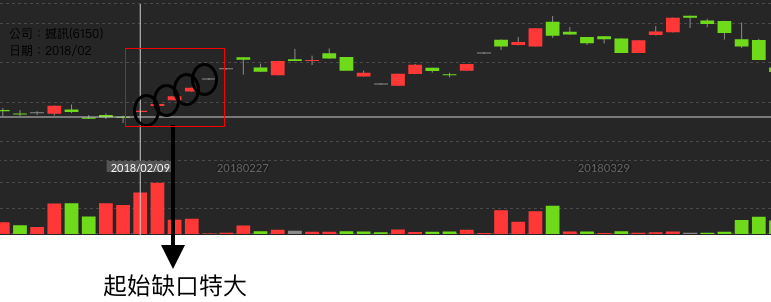
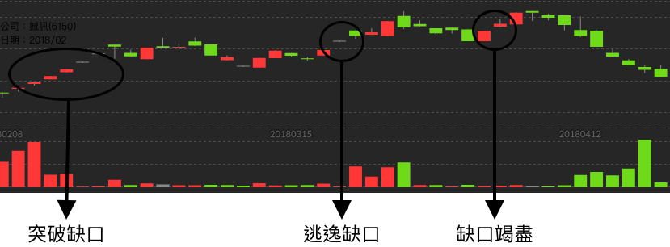

# 起始缺口特大

我們常說基礎下的越扎實，成長的力道越強勁。

上圖是使用日線的Ｋ線圖進行查看震訊，在2018年2月9號附近，出現了一個缺口突破的現象，然而在短短四天內足足出現了四五次缺口向上跳空。

當我們把鏡頭往近一點去看，我們可以看到。在跳空發生後幾天，有了兩個一字型的漲停板，這也就是關鍵所在之處，就像是要告訴大家我準備要飆高羅

當然再飆高的過程中，我們也可以發現之前分享過的缺口上升三部曲的缺口種類。記得不要在最高點套牢喔。

上圖是使用日線的Ｋ線圖進行查看震訊，在3月19日左右出現了逃逸缺口，並且在4月初的時候出現了缺口竭盡的現象。想當然之後就跌落谷底了。

> 投資買賣的時候，千萬不要追高，一定要看到現象再進行購買; 也要往前看歷史的資訊，避免買的時候是最高點的缺口竭盡。才不會被套牢唷～

