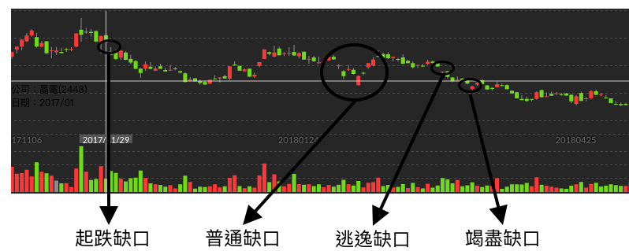

# 缺口的種類

當然缺口種類也有分為四種：普通缺口、缺口突破、逃逸缺口、缺口竭盡。

### 缺口上升三部曲

上圖是使用日線的Ｋ線圖進行查看，在2020年1月9號附近，出現了一個缺口突破的現象，隔天就跑出大陽線，之後稍微跑出一次賣壓的逃逸缺口以及後面的缺口竭盡現象。

### 缺口下降三部曲

上圖是使用日線的Ｋ線圖進行查看晶電，在2017年1月29號附近，出現了一個缺口突破的現象，隔天就跑出下降跳空。但是這個比上一張圖難看懂是因為在中間的時候有好多個普通缺口跳出來搗亂，不過不影響之後的逃逸缺口現象判斷。當最後的竭盡缺口出現，記得要趕快離場，千萬別被套牢。

### 缺口的種類介紹

| 缺口種類 | 現象敘述 | 代表意思 |
| :--- | :--- | :--- |
| 普通缺口 | 短期內\(三天\)股價有回補的現象。 | 無法強烈提供後續走勢的預測資訊 |
| 缺口突破 | 短期內沒有回到原有水準\(無回補\)。 | 表示賣壓方逐漸被消化完畢，這時候如果也伴隨大量買超，將會是一個好的買入時機 |
| 逃逸缺口 | 發生突破缺口後，再一次的缺口現象發生。 | 這個缺口比較有意思，通常這個缺口會位於突破缺口與竭盡缺口的中間價位。也因此，在這個缺口發生後，還有一些時間能夠衡量，也叫做衡量缺口。 |
| 缺口竭盡 | 發生上面兩個缺口後，在發生一次缺口現象。 | 當這個缺口發生時，通常有大部分的投資人覺得要儘早退場、獲利了結; 也就會發生了大量賣壓。 |

因此當缺口發生的時候，可以先觀察幾天，在進行判斷。

