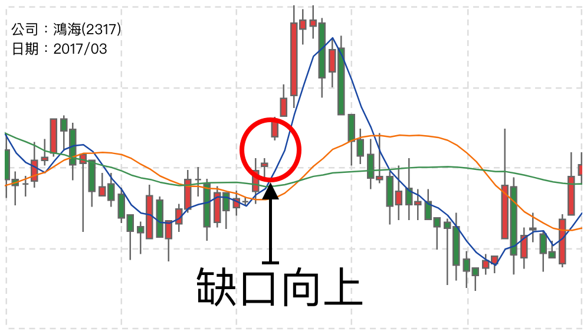

# 缺口向上

缺口一直以來是在Ｋ線圖上扮演一個重要的驚嘆號角色，它強烈地告訴我們目前這檔股票正準備發生一件大事情。

上圖是使用季線的Ｋ線圖進行查看，在2017年3月31號附近，出現了一個大缺口，而且是向上跳空。這表示投資人正準備大量買進。  
相關背景資訊：是因為在那天附近，發布了2017年以前的一年財報，創下出亮眼的成績單，並且買下的夏普也出現了稅後淨利益為正的資訊。因此那一段時間都是多方買入。

