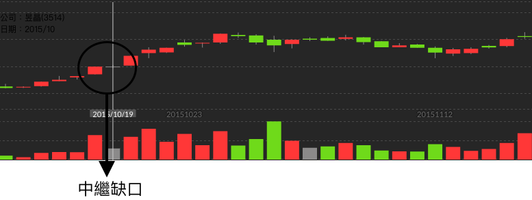

# 中繼缺口

在長紅以及十字線的現象發生時，我們可以探討一下該公司是否有多頭的趨勢。

我們在2015年10月19日發現了一個中繼缺口\(長紅+十字線\)的誕生。這時候我們可以看一下當時候的歷史事件。

* 10/14~16 一年一度太陽光電年度盛會-「PV Taiwan 2015 國際太陽光電展覽會」即將於14-16日展開，參展廠商高達上百家，而國內包括太陽能股王碩禾（3691）、新日光（3576）、昱晶（3514）旗下的同昱、今年甫上市的元晶太陽能（6443）、友達光電（2409）、有成精密、英穩達等都參展。
* 當時候營收是屬於正成長的\(比起其一段世間的情況來說\)。
* 太陽能產能以及毛利率等公司基本資訊

多項數據顯示這在當時候是一間很看好的公司。因此我們才可以在那時候斷定，我們可以入場

> 多項數據顯示這在當時候是一間很看好的公司。因此我們才可以在那時候斷定，我們可以入場。  
> 千萬不要因為某些現象發生\(中繼缺口\)，就快速買入，還是得配合其他資訊一並服用哦～

