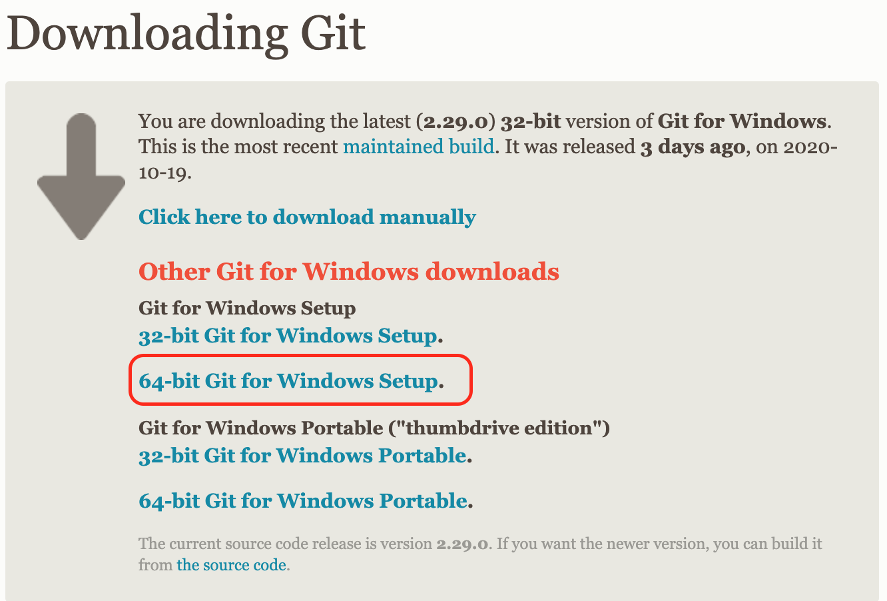

# 安裝GIT

### 資料連結

* [git官網](https://git-scm.com/)
* [git-download-windows](https://git-scm.com/download/win)

### windows

進入[載點](https://git-scm.com/download/win) 之後點選適合的版本（通常如下圖即可）



下載完之後，執行檔案，並一直按下一步即可。  
安裝完成之後，點選搜尋\(左下角\)，找尋Git Bash點選之後，會彈出小黑窗，咱們就可以在上面進行git指令操作了～～～

```bash
which git
git --version
```

如果有跳出資訊\(沒有錯誤訊息\)，那就表示安裝完成了～～～

### 

### ubuntu

基本上最新的版本都會預測安裝`git`了，如果沒有的話還是能夠安裝的。

```bash
sudo apt-get update
sudo apt-get install git
```

一樣確認一下是否安裝成功

```bash
which git
git --version
```


### Mac

基本上都已經預設有了`git`了，如果沒有的話在安裝

```bash
brew install git
```

一樣確認一下是否安裝成功

```bash
which git
git --version
```


> 這樣就完成安裝了，是不是很簡單啊～  
> 接下來我們來正式開始學習git羅～

