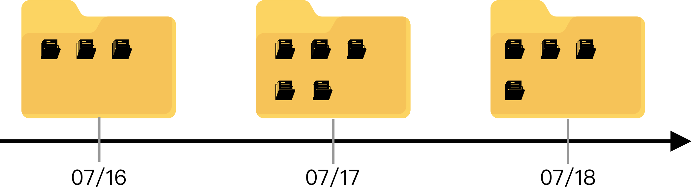

# GIT

相信如果您有認識資訊圈內的人，他們在談論過程中時不時會說出git這個詞。那什麼是git呢？  
大部分的人應該會回答您說：是一個版本控制的套件。  
專業一點的人可能就會說：是一個分散式的版本檔案控制系統。

相信您一定還是聽不清楚，讓我來舉個最相似的例子，那就是google-drive。  
當我們上傳上去東西的時候，會發現右邊列，會有版本不同的資訊提及。  
git跟google-drive很類似，都是在控制檔案的版本。

### 什麼是檔案版本控制系統？

###  

如上圖，我們在07/16日的時候新增了三個檔案作為主要記錄檔案。  
到了07/17日的時候，發現我們需要額外兩個當記錄檔案。  
最後在07/18日砍了一個檔案。

#### 如果在08/01日，老闆突然跟我說，我需要07/17的那個檔案\(07/18刪除的那一份\)，這時候怎麼辦呢？都過那麼久了，我怎麼可能記得 ！！！

這時候，就是`git` 發威的時候，他是可以回朔回去，讓你翻找那一份檔案的唷～～～  
是不是很方便又很厲害 ！！！

> 當然實際應用的時候，還有很多功能，這會在之後的章節進行討論的～
>
> 請注意，本教學將以Mac系統作為操作，會有一些小部分圖案不太一樣哦\(git指令都一樣，請別擔心\)

  

