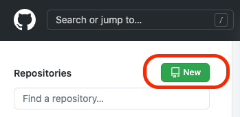
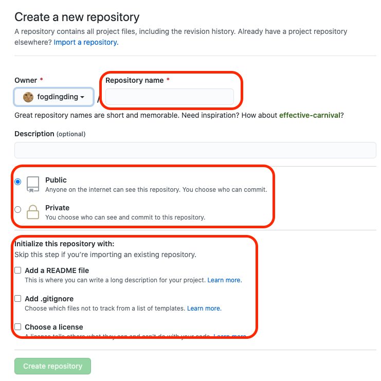
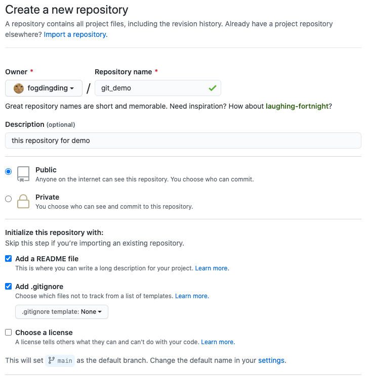
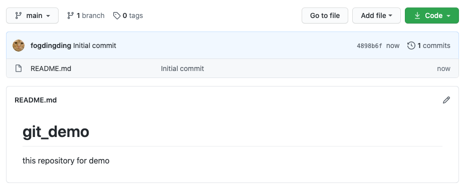
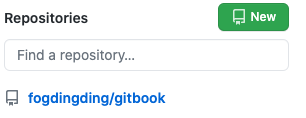

# 建立一個repository

### 專案建立

在登入git後，可以在左上角看到`New` ，請點選他

點選後，我們就能開始建立一個屬於自己的repository

第一個是repository的名稱、是否公開、是否先替您創立這西檔案。

填好後如下

之後就能看到這個畫面了\(建立完成\)

下次近來`github`之後，就會在左邊欄位看到已經建立的repository

