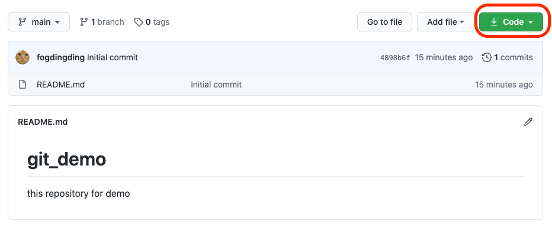

# 基礎使用-clone

### 從github clone下來

上一單元我們建立了一個repository，請前往～之後再點選Code



之後在附註這串網址\(可以點選旁邊的icon直接複製哦！\)


完成之後我們就能來操作指令。（打開終端機）

```bash
git clone https://github.com/fogdingding/git_demo.git
```

之後會請您輸入帳號以及密碼。

輸入完成之後，我們就可以看到他已經從雲端上把檔案抓下來了。

```bash
cd git_demo
```

可以看到他的檔案結構

```bash
.
└── README.md
```

這樣我們就完成clone的部分了。

