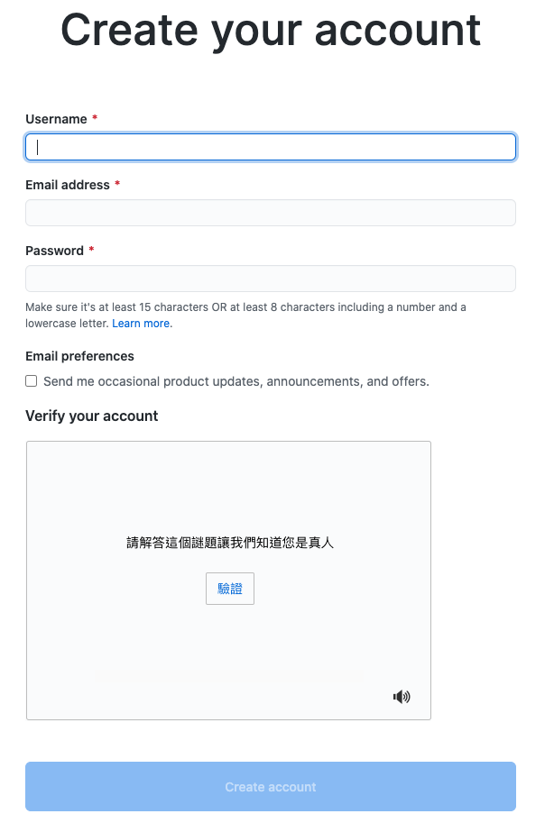

# 申辦github帳號

### 資料來源

* [github官網](https://github.com/)

### 官網註冊

再官網右上角點選註冊後，填寫以下資料，並前往信箱認證即可完成註冊。

> 為什麼要申請呢？  
> 因為這是一個免費在雲端上備份自己的專案的開源網站，在上面大家會分享自己所寫的程式碼以及專案。  
> 畢竟除了檔案版本控管，異地備援\(在兩台不同的主機上備份\)也是很重要的呢！

