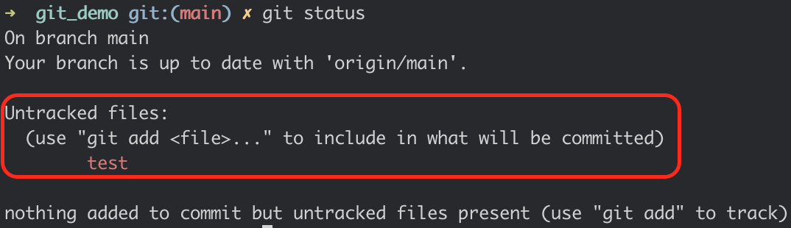
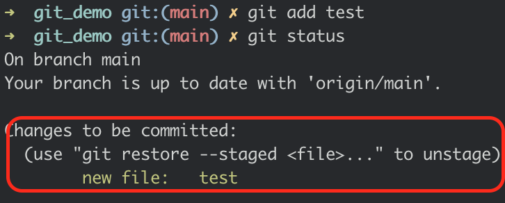
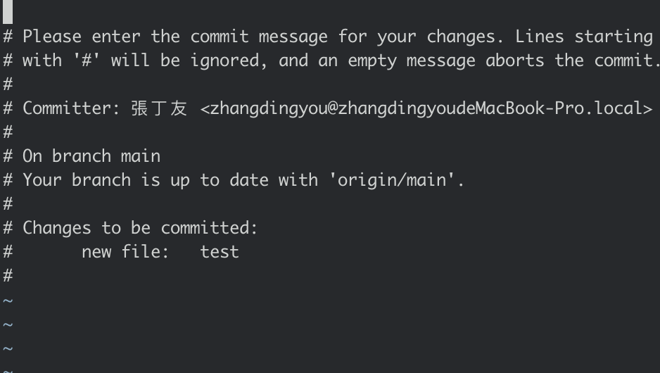
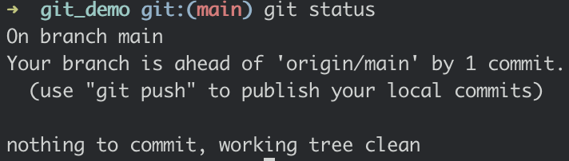
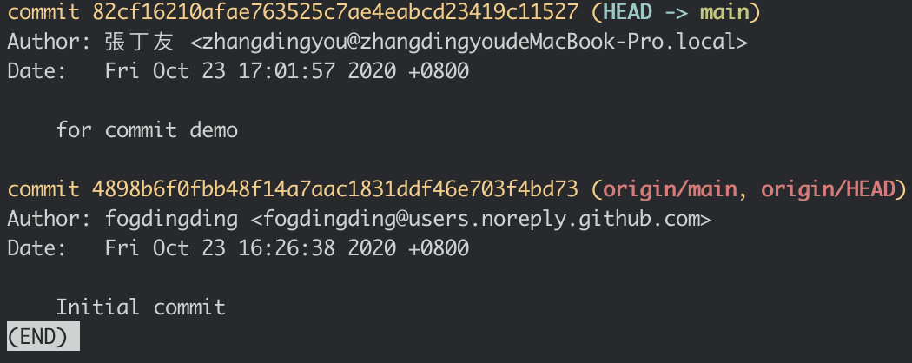

# 基礎使用-status、add、commit、log

### status

首先我們建立一個`test`的文件檔案。

```text
vim test
```

並在裡面隨意地打一些字，存檔\(`esc`+`:`+`wq`+`enter`\)\(依照順序鍵入\) 離開

```text
hello git!
```

> vim 是一個程式介面的編輯器，詳細使用教學會在其他課程上提到。

完成之後，我們可以先來查看目前的狀態

```text
git status
```

會出現以下資訊，告知您說我尚未追蹤這個檔案哦～



這個時候我們就需要學習到`add`了

### add

在終端器上打入

```text
git add test
git status
```

 這一次就會告訴您不一樣的資訊羅\(我追蹤了一個新的檔案，名為test\)



### commit

這一個地方是版本控制最重要的時候了，每一次的更改都必須到commit這一個環節才算被儲存起來哦！

在終端機上鍵入

```text
git commit -a
```

就會出現以下資訊，讓您打入一些備註訊息，這樣下次看到的時候就不會忘了這一次做了些什麼唷～\(可以打入 `for commit demo`\)



打完之後一樣存擋。在下一次`status`

```text
git status
```

疑？我剛剛的資訊怎麼不見了！！！！



別急，還記得我們剛剛說的，`git`是一個版本控制系統。  
也就是說，當我們下達`commit`的時候，他才會幫我們跟上一個版本作切割。

那我們怎麼知道，版本有哪些呢？

### log

```text
git log
```

我們會看到以下資訊。



其中有兩列黃色的字體，下面那一列的是當初我們在`guthub` 上進行創立的時候，它自動幫我們建立好的`commit ;`而上面那一列則是我們剛剛建立的commit哦～


> 這個單元我們學到了  
> status：查看目前狀態，是否有新增檔案、修改檔案、刪除檔案  
> add：新增追蹤目前新增的檔案。  
> commit：儲存目前已經更改的資訊。  
> log：查看歷史的`commit`

下一個單元，我們會介紹`遠端上的git`以及`本地端上的git`


