# 簡介

GaisSchool是一個線上學習平台，我們將提供學生無實務課都能在線上進行學習，以下將會先以學生的角度進行簡單的使用教學。

### 學生帳號

登入[網站連結](https://school.gais.org.tw/)後，我們能夠看到以下畫面。

如果學生想要使用GaisSchool平台來進行學習，首先需要先註冊帳號。（點選右上角-註冊按鈕）

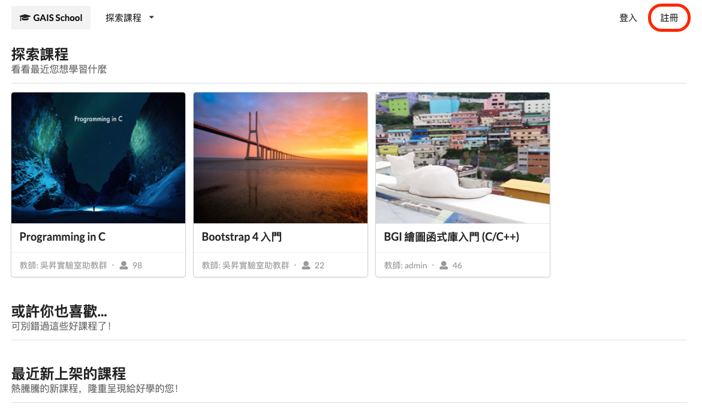

即可進入到註冊畫面。

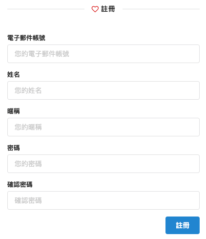

> 這邊我們會以電子郵件作為您的帳號。

再填入相關資料後，我們會寄送一封電子郵件給您，請您點選信件上的連結即可解鎖登入條件。

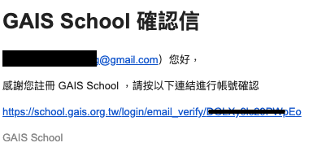

解鎖帳號限制之後，再回到平台首頁，點選登入。

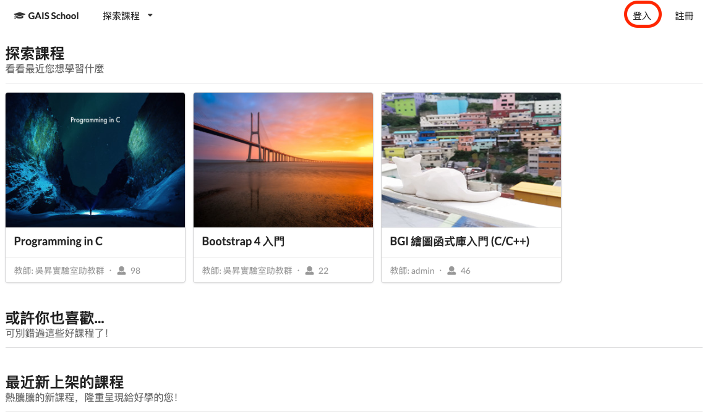

即可看到以下畫面。輸入電子郵件作為帳號，以及您的密碼做登入。

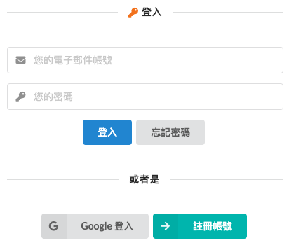

> 這邊，我們也提供Google帳號的直接登入。

登入之後，就能開始加入想要學習的課程。（點選Ｃ語言）

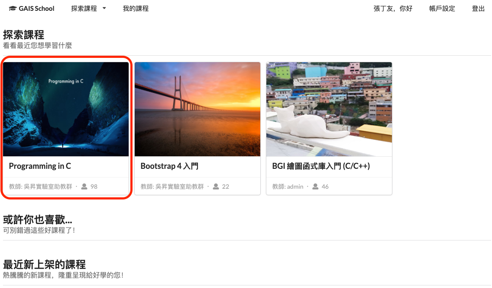

在一開始的部分，基於老師所設計的課程是否提供試讀，可以讓學生們先進行觀看。

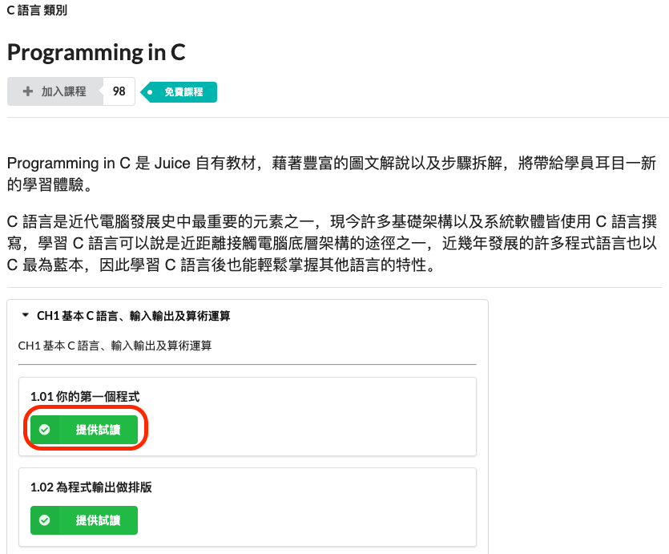

如果未提供的話，就會如圖下。

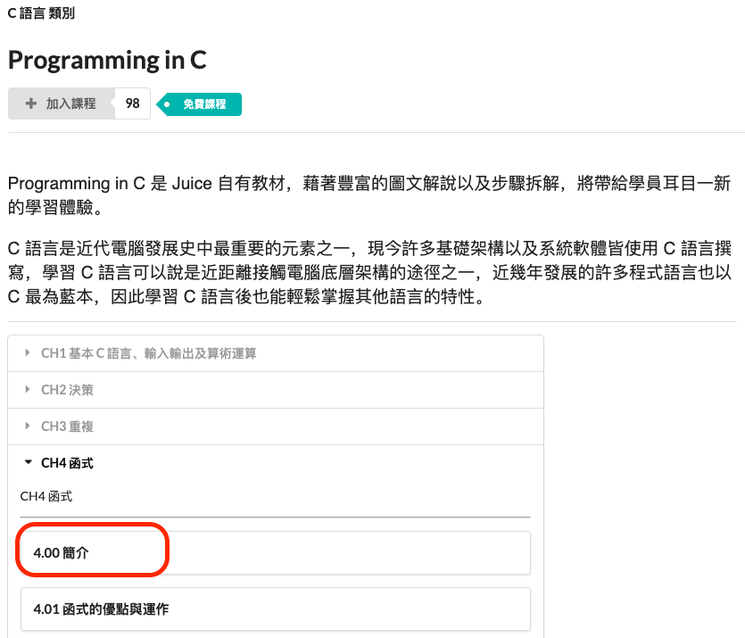

點選加入課程後，就會開始進行課程。

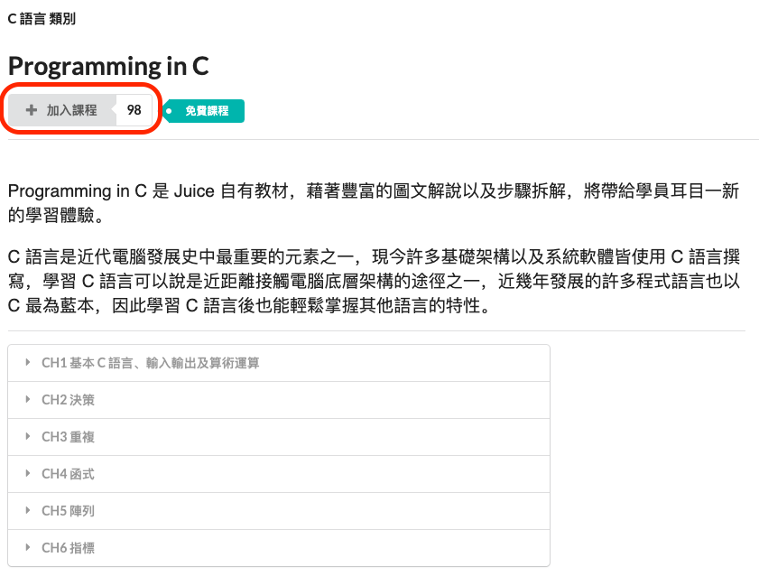

課程開始後，我們就能點選想要看的章節或是單元。（這邊提供剛剛無法觀看的單元範例圖）

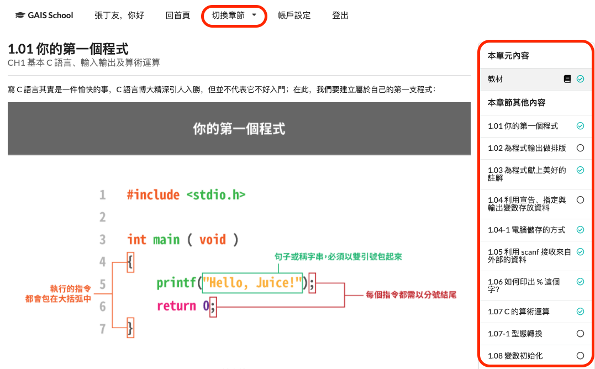

切換完成後，就能看到剛剛無法試讀的部分。

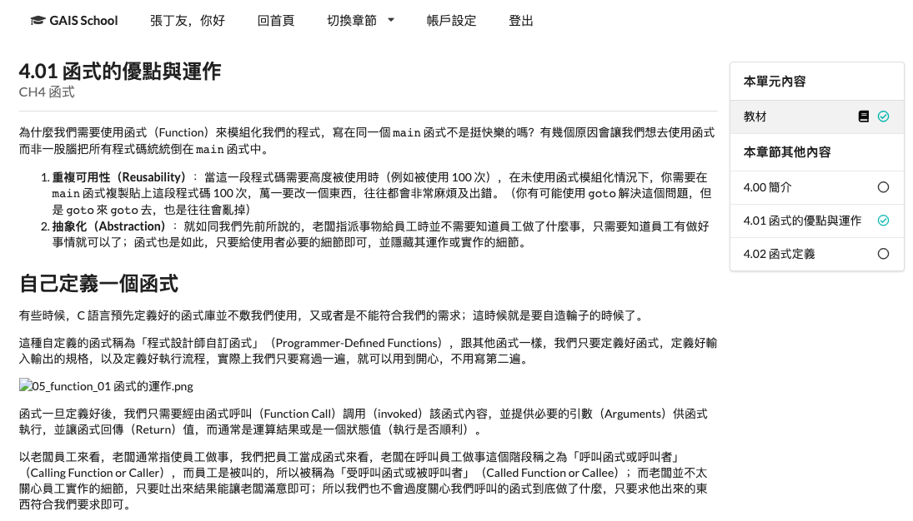

未來想要在查看目前已加入的課程，只需要點選我的課程。

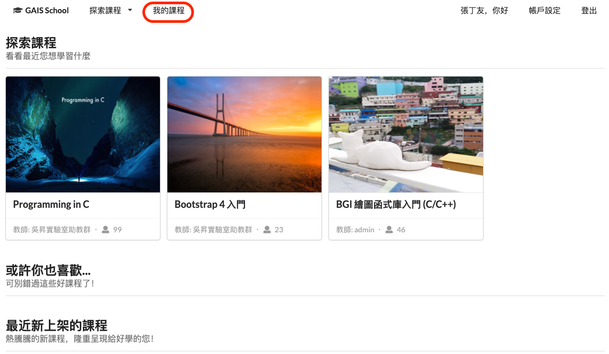

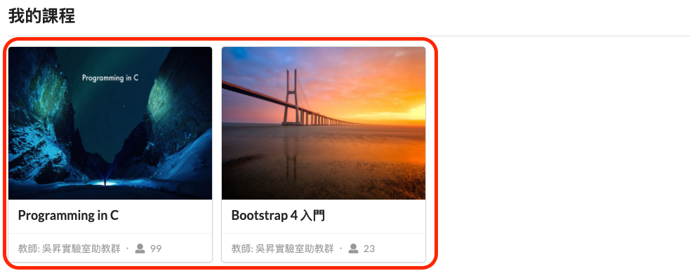

