# 新增課程與章節

### 教師帳號

#### 建置課程

首先我們使用教師帳號進行登入，登入之後會看到畫面跟學生帳號差不多。  
但是在右上角會多一個課程管理。

進入之後，會看到我們主要有三個項目可以做新增與修改。（課程管理、測驗管理以及題庫管理）

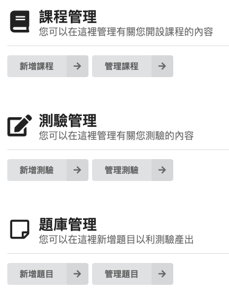

那首先我們先一個新增課程，點選新增課程後。

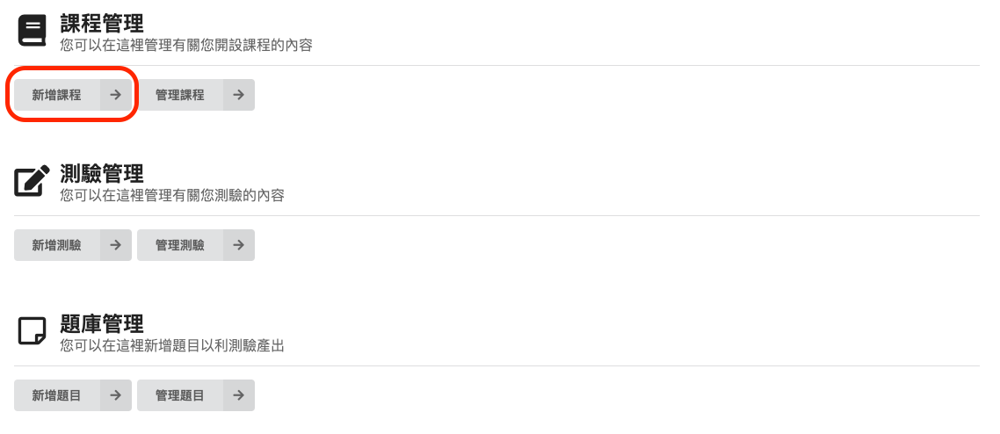

即可看到以下畫面。填選相關資訊即可新增課程。  
主要需要課程名稱，以及這堂課的簡介描述。

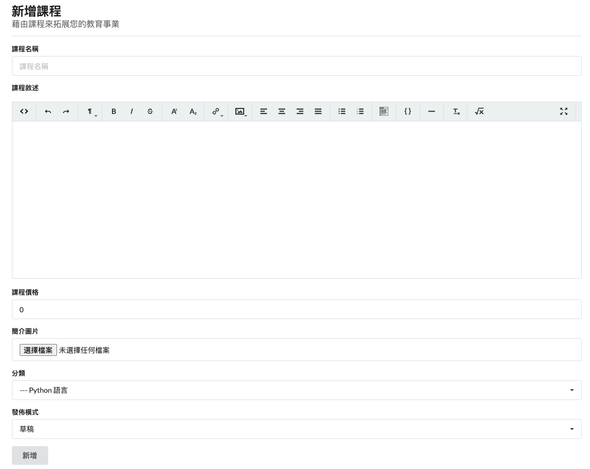

而在課程價格的部分，如果您想要無私的分享給大家，價格填寫為零即可。  
當然，如果您想要收取一點點費用，在上面輸入您想要的數字即可。

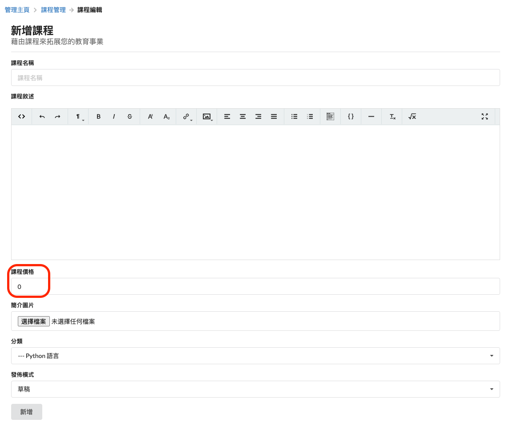

下一個該注意的是發布模式，當您還在進行基本的教材建置，應該要為草稿模式。  
如果當您建置的很完善這份教材後，就可以更改為發布模式。

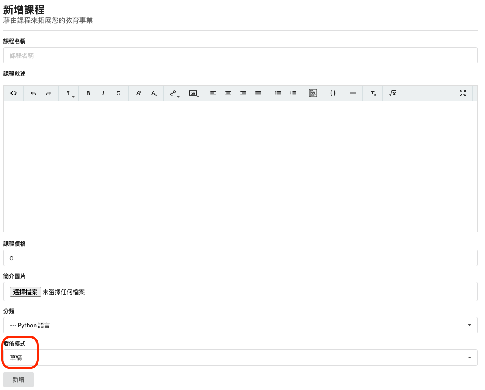

管理課程

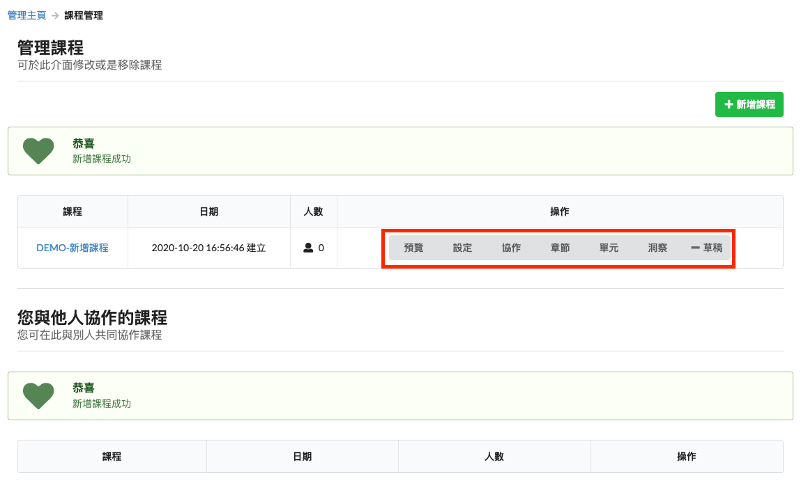

* 預覽
  * 可供教師確認目前新增的章節單元是否符合預期。
* 設定
  * 可以修正目前課程的簡介、圖像、發布狀態等。
* 協作
  * 可以邀請他人與您一同進行這份教材的編輯。
* 章節
  * 該課程的章節新增。
* 單元
  * 某個章節的單元新增。
* 洞察
  * 為您提供目前該課程的一些資訊，點擊人數、學生人數、學生基本資料等。
* 草稿
  * 目前該課程的發布狀態為何？（有草稿以及公開兩個狀態）。

#### 新增章節

點選章節，即可開始新增。

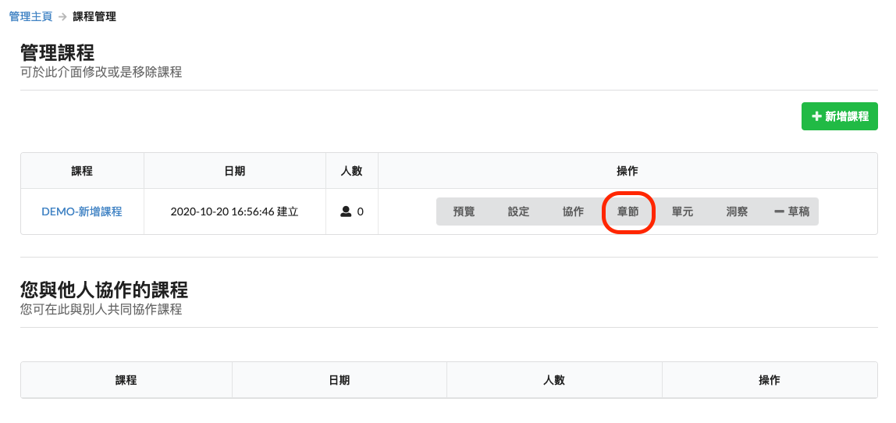

出現以下畫面後，即可開始新增章節

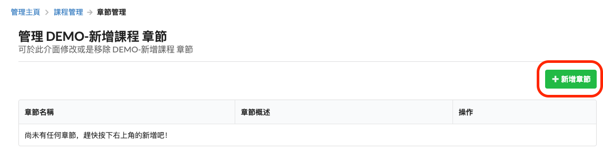

填寫章節名稱以及簡單的敘述，讓學生能夠快速抓到大綱。

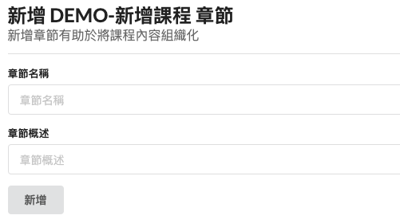

#### 預覽課程

點選預覽

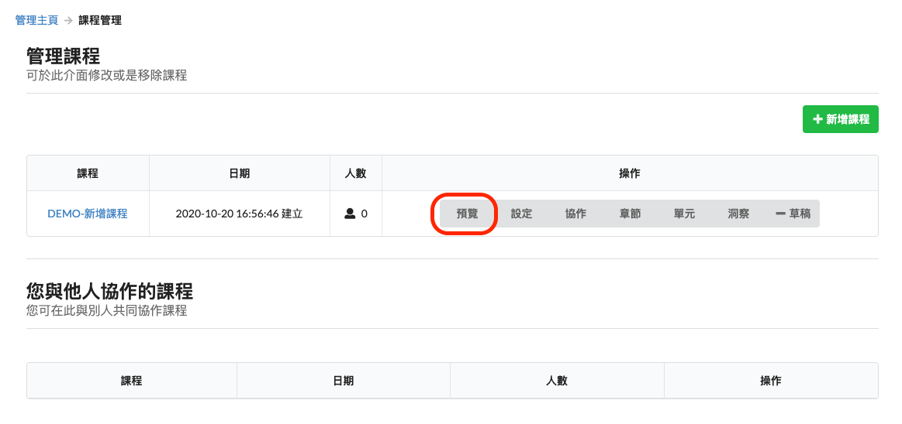

就可看到我們剛剛新增的課程章節

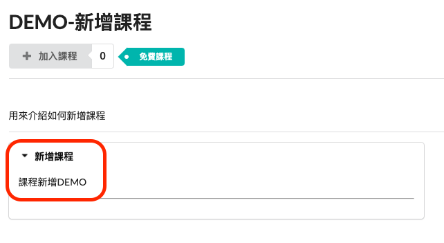

