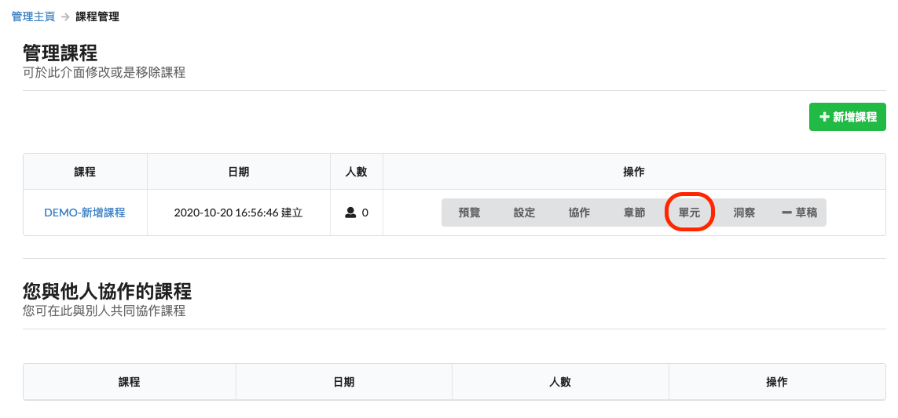
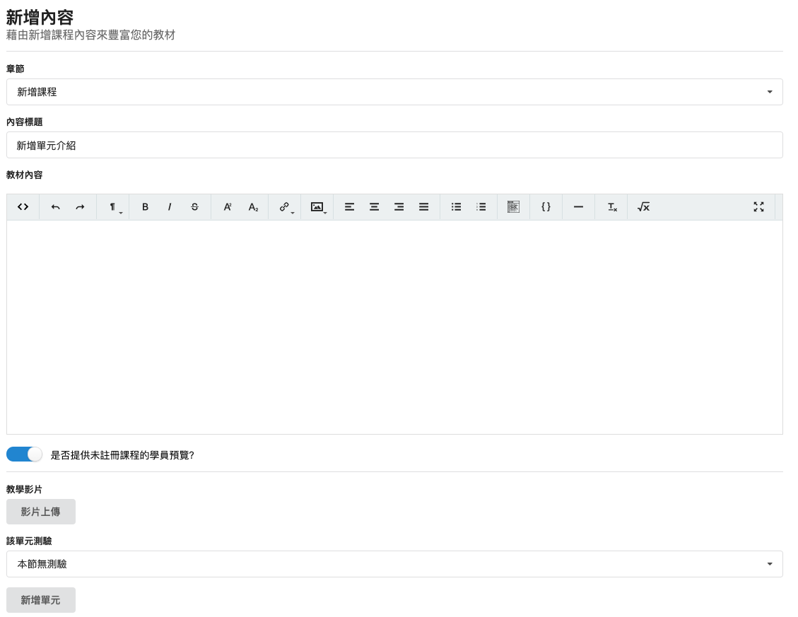
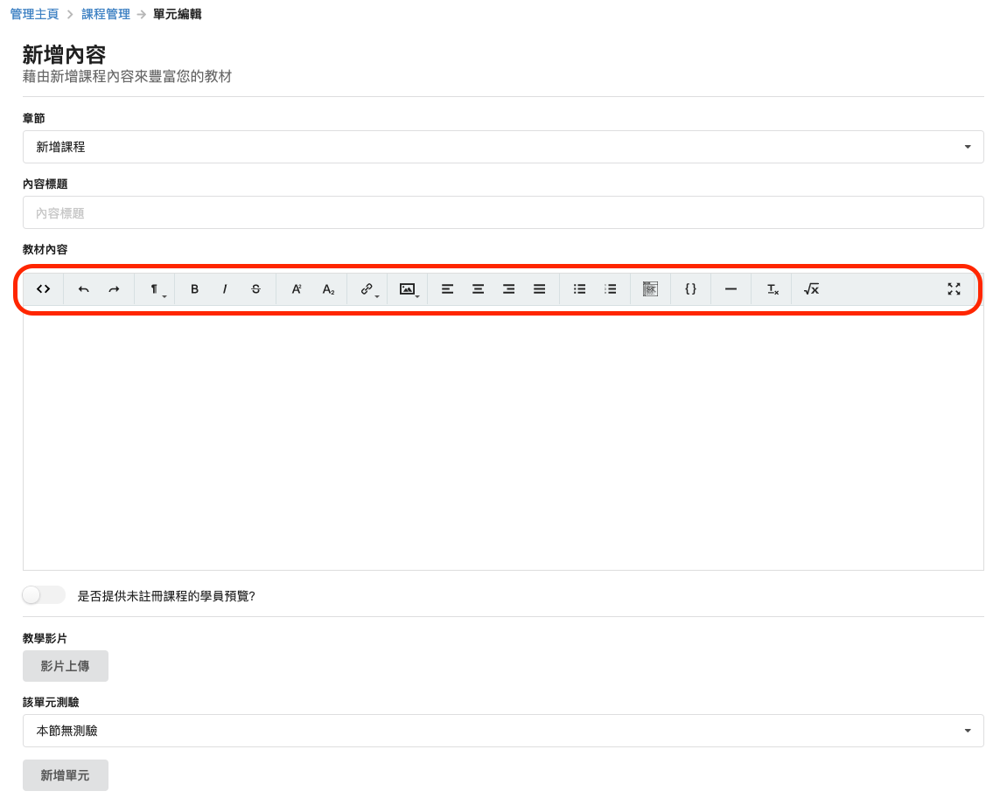
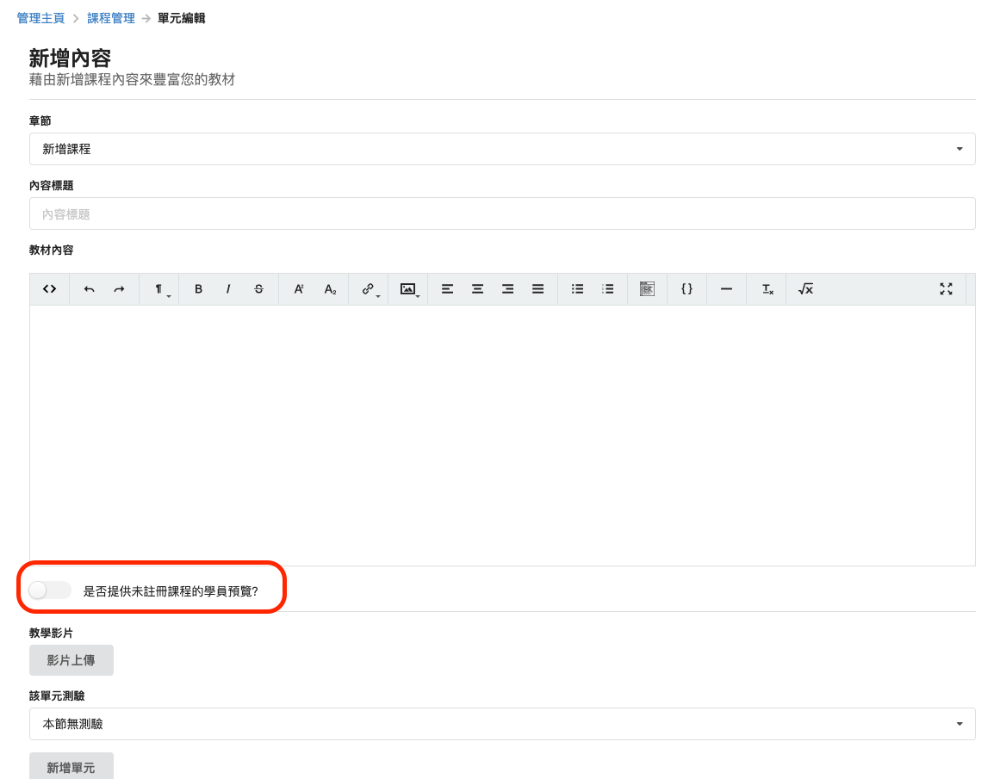
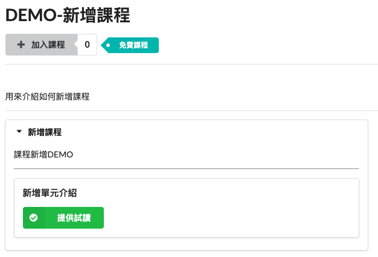
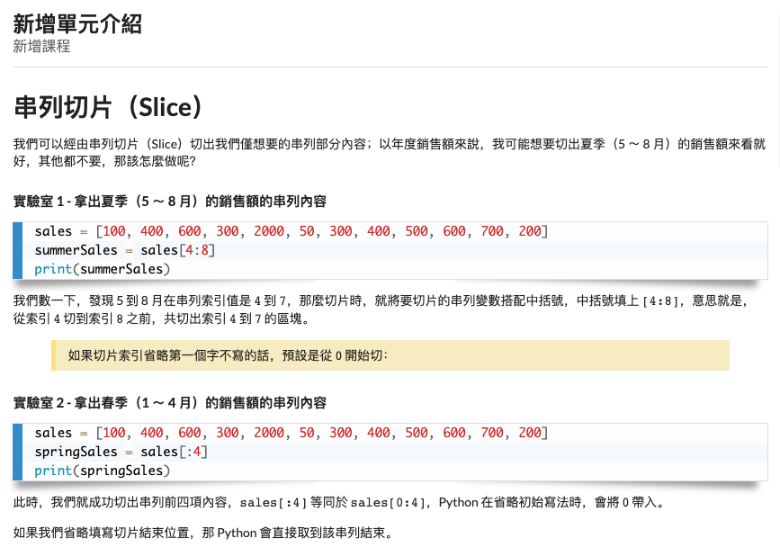

# 新增單元

### 教師帳號

點選單元，即可進入單元內容編輯畫面

單元-內容管理，先點選新增內容

填寫相關的單元內容

善用編輯列來進行章節的頁面呈現（提供基本的粗體、字行、連結、程式碼、數學式等功能）

這邊有一個選項是，是否提供給未註冊課程的學生進行預覽？

之後再前往預覽，進行預覽。（使用先前在其他地方已經編寫好的課程做範例）

> 如果畫面沒有提供試讀，表示當初的選項並沒有勾選，因此預覽模式下會無法看到哦～

