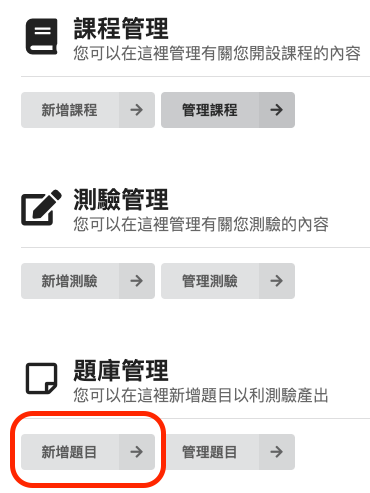
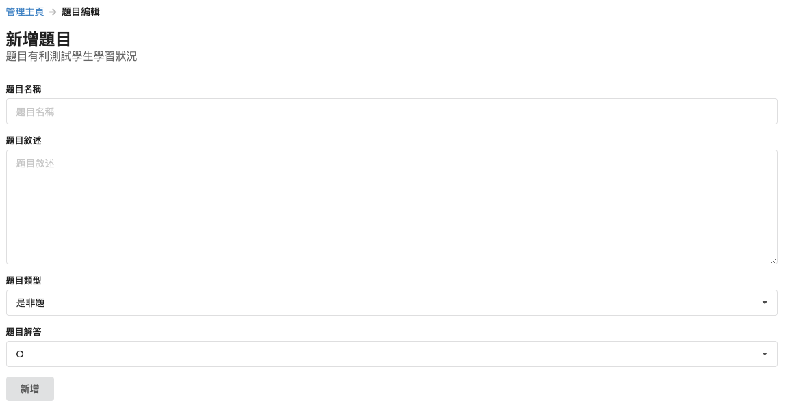
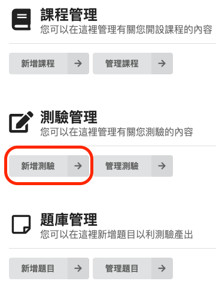
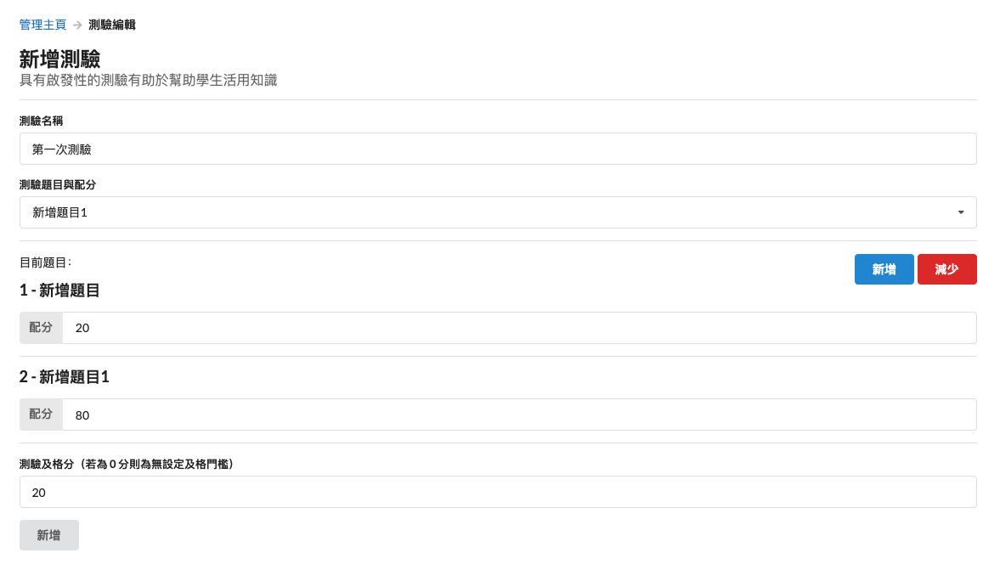
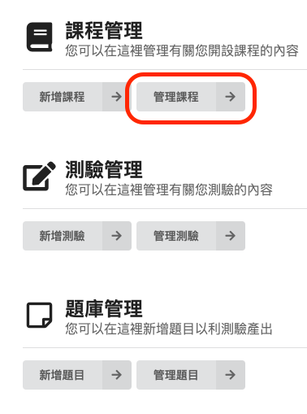
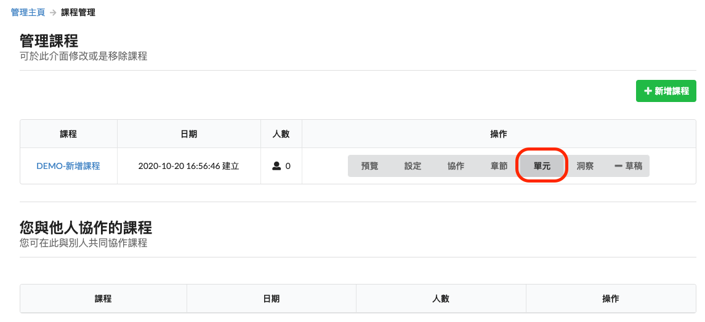
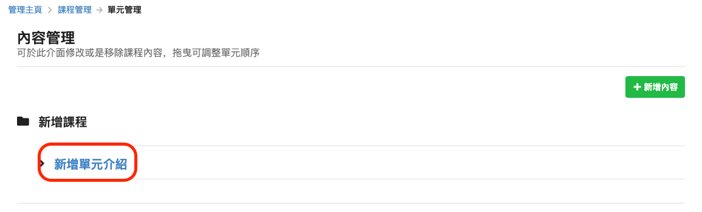
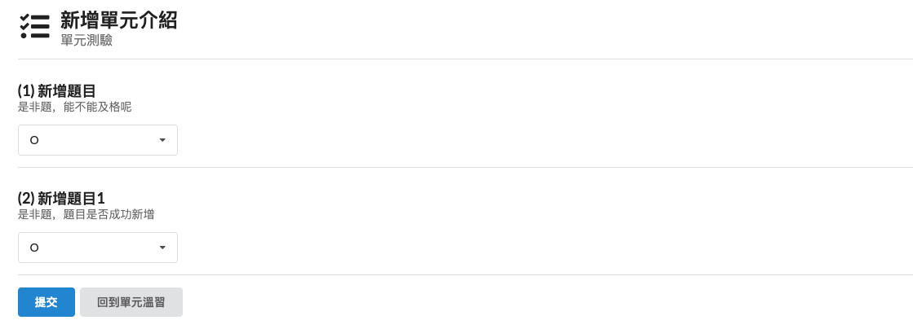
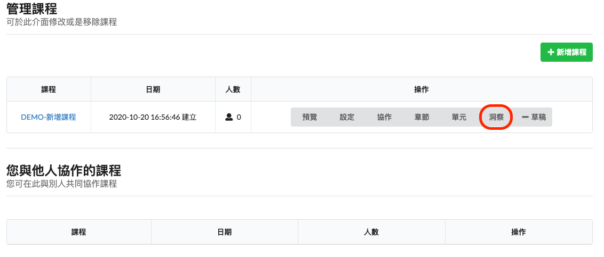
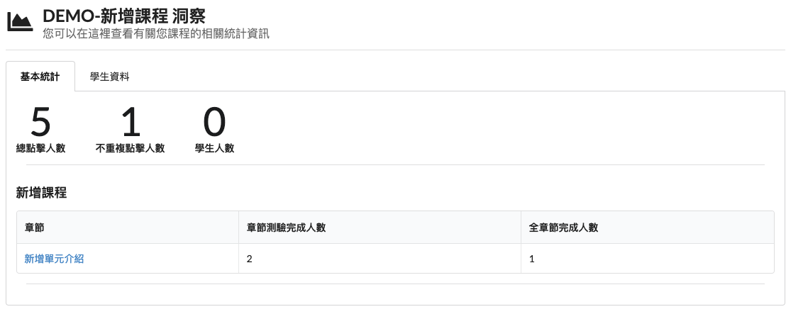

# 新增測驗、洞察

### 教師帳號

有時候我們會需要讓學生做一些測驗，我們才能得知學生的學習進度為何？

### 題目新增

首先我們先新增題目

新增完成後，也可以到管理題目上進行修改。

### 測驗新增

點選後，就能進行測驗的新增。

### 單元內容新增測驗

首先點選管理課程

在點選該課程的單元

點選於想加入的測驗的單元

修改單元測驗的選項

前往預覽並到該單元進行查看，點選測驗

即可看到測驗內容

### 學習狀態分析

教師可以查看目前的學生學習進度

點選洞察，即可看到學生的章節單元完成度。

